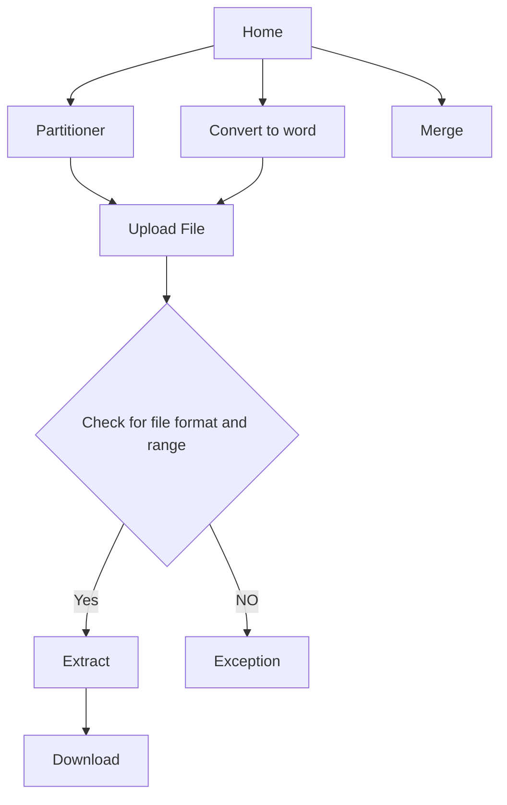

# PDF-Partitioner

## Hosted on: (Only partitioner)
https://bloggyweb.pythonanywhere.com/

## Description:
This flask based web application is designed for:
1. Extracting pages from a PDF from a specified range. eg- From a 100 page PDF, extract page 2 to 17.   &#x2611;
2. Converting PDF into words.                                                                         &#x2611;
3. Merge PDF files. (ongoing)                                                                         &#x2610;

The project follows MVC architecture, industry level coding standards, feature branching (for Github), unit testing and as well as hosted in a remote server.

## Flow Chart

## Tools and Packages:

| Package            |  Usage                                              | 
| :-------------:    |:-------------:                                      | 
|  PyPDF2 3.0.1      | To read pdf and create a new pdf                    |  
|  pdf2docx 0.5.8    | To convert pdf into word                            |   
|  Flask 3.0.2       | To Create API endpoints and for overall hosting     |  

## Future plans:
1. Can extend to some other pdf operations like, text extraction, pdf to ppt, pdf signature etc.
